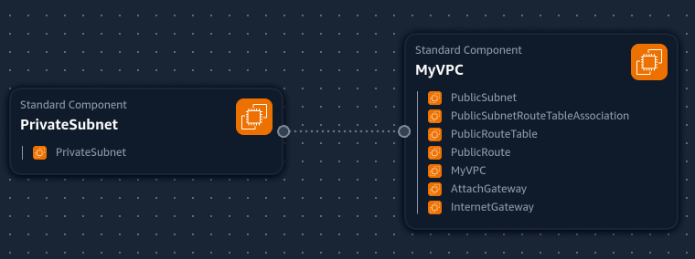
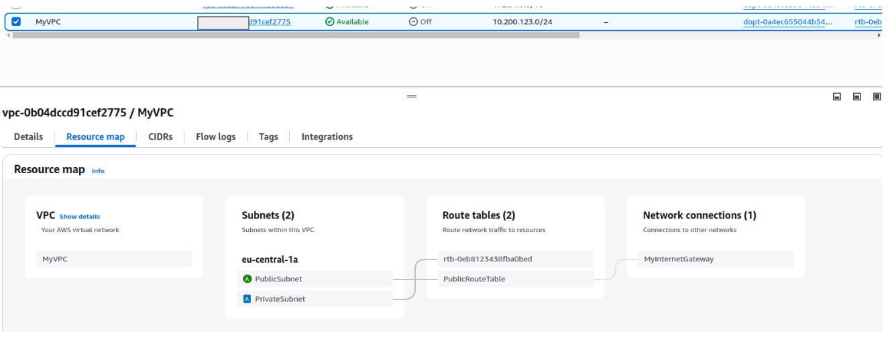

## VPC Settings

These are the VPC ssettings we observed Tim Setup for our cloud environment in AWS:

- VPC IPv4 CIDR Block: 10.200.123.0/24
- IPv6 CIDR Block: No
- Number of AZs: 1
- Number of public subnets: 1
- Number of private subnets: 1
- NAR GETEWAYS: None
- VPC Endpoints: None
- DNS Options: Enable DNS Hostnames
- DNS Options: Enable DNS Resolution

## Generated and Review CFN Template

Watching the instructor's videos, I noted the VPC Setings, provided this to LLM to produce the CFN template to automate the provision of the VPC  infrastructure.

- I had to ask ChatGPT to refractor the parameters so that it would not hardcode values and the template is more reusable.

## Generated Deploy Script

Using ChatGPT generated a nash script `bin/deploy`.

I changed the shebang to work for all OS platforms.

##  Visualization in Infrastracture Composer

## Installing AWS CLI 

In order to deploy via the AWS CLI, we need to install it.

We follow the install instructions:
https://docs.aws.amazon.com/cli/latest/userguide/getting-started-install.html

## Deployed Resource map of the VPC with CNF.

